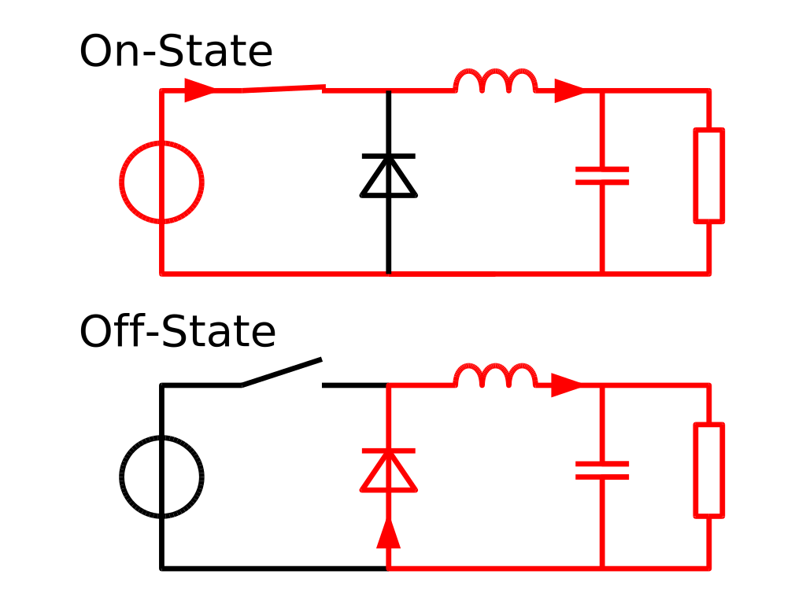
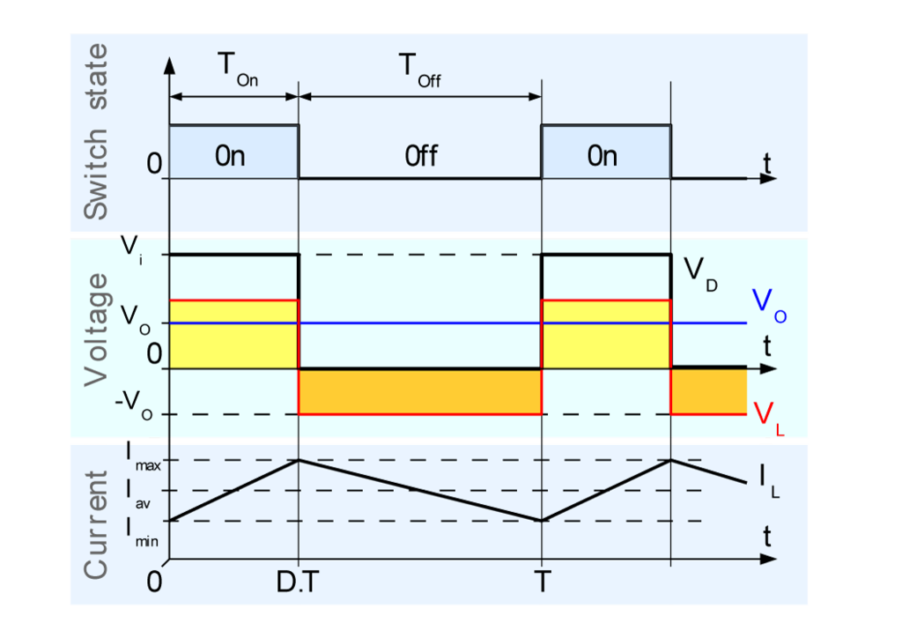

Maximum Power Point Tracking (MPPT)
===================================

Maximum Power Point Tracking (MPPT) uses the well know fact that in order to extract the maximum power from a source you must match the impedance of the load with the impedance of the source. 
However, the I-V characteristics of a solar panel make this task not so easy to accomplish. When looking at the I-V characteristics of a solar panel (Instert Picture) you can see that there is a point on the curve at which the Voltage and Current are both at their maximum. 
Since power in an electronic circuit is related by :math:`P=V\cdot I` you can see how having V at a maximum and I at a maximum creates the maximum amount of power. 
Unfortunately this only occurs at a certain load resistance. You also dicern from the I-V characteristic curve of a solar panel that if you were to deviate just slightly from that ideal resistance there would be a very large drop in the amount of power that is being produced. 
Usually however you are not so lucky with your load resistance as it can be changing constantly. What would work great is if there was a way to have a resistor that could be changed in order to constantly match this ideal resistance. If this were an AC circuit it could be done very easily with a transformer as a resistance seen across a transformer is described as :math:`R_p = N^2 \cdot R_s` where :math:`R_p` is the resistor on the primary side, :math:`R_s` is the resistor on the secondary side, and N is the turns ratio of the transformer. Unfortunately this is a DC circit and not an AC circuit.  

How Buck Converters are "DC Transformers"
----------------------------------------------
Transformers for DC circuits don't really exist. However, there is a very clever way of taking a DC source turning into AC and then back into DC all in one concise circuit. These circuits are called switching mode DC-to-DC converters. There exists many circuit topologies that are all based around the same concept of taking a DC signal converting it to AC then back to DC. Some of these circuit topologies are SEPIC, Cuk, Buck, Boost, and Buck-Boost. In this document we are only going to focus on Buck converters. This is because the output voltage of the solar panel is around 18V which will then need to be converted to 4.2V to charge the lipo battery. 

The Buck converter circuit topology is shown below. In all switching mode DC converters there is always a switch which will switch on and off at a given frequency :math:`f_s` with a given duty cycle represented by :math:`D`.
Usually, this switch is implemented by the use of MOSFET transistor where the gate is connected to a control signal that provides a squarewave at :math:`f_s` with the desired duty cycle. 
Now we can see how this duty cycle :math:`D` is actually analogous to the turns ratio of an AC circuit.

Starting the analysis by identifying two different states that the buck converter can be in. The first being when the switch is on and the second is when the switch is off. For this analysis we are going to treat the MOSFET as just a simple switch. We must also make the assumption that the circuit is in steady state, the inductor current is always positive, the capacitor is very large, and the switching period is :math:`T`. This implies that the switch is closed for :math:`DT` and the switch is open for :math:`(1-D)T` time. 

   Buck Converter (*Wikipedia*, 2019)

Closed Switch Analysis
^^^^^^^^^^^^^^^^^^^^^^

When the switch is closed the diode is reverse-biased and the equivalent circuit can be seen represented by the On-State in the figure above. Starting with the analysis of this circuit we can see that the 
voltage across the inductor can be represented by

.. math::

   v_L = V_s - V_o = L\frac{di_L}{dt}

where :math:`V_s` and :math:`V_o` are the source and output voltage respectively. Rearraging a little bit we obtain

.. math::

   \frac{di_L}{dt} = \frac{\Delta i_L}{\Delta t} = \frac{\Delta i_L}{DT} = \frac{V_s-V_o}{L}

We now have an expression for current when the switch is closed 

.. math::
   
   (\Delta i_L)_{closed} = (\frac{V_s-V_o}{L})DT

since we assumed that the derivative of the current is a positive constant. This can be observed in the graph below by the rising slope of the current.

Open Switch Analysis
^^^^^^^^^^^^^^^^^^^^

When the switch is open the diode is no longer reverse-biased and the equivalent circuit can be seen represented by the Off-State in the figure above. Starting again with analyzing the voltage across the inductor we obtain the following relationship.

.. math::

   v_L = - V_o = L\frac{di_L}{dt}

Rearranging

.. math::

   \frac{di_L}{dt} = \frac{-V_o}{L}
   
Now instead of the derivative of current in the inductor being positive constant it is negative constant, which again imples the expression

.. math::

   \frac{\Delta i_L}{(1-D)T} = \frac{-V_o}{L}

which when rearranged gives us the current through the inductor when the switch is open.

.. math::
   
   (\Delta i_L)_{open} = (\frac{-V_o}{L})(1-D)T

Looking closely at the figure given below you can see that the amount that the current rises while the switch is closed is the same amount that the current falls when the switch is open. Therefore we can write

.. math::

   
   (\Delta i_L)_{open} + (\Delta i_L)_{closed} = 0 \\
   \therefore \\
   (\frac{-V_o}{L})(1-D)T + (\frac{V_s-V_o}{L})DT = 0

Which when you solve for :math:`V_o` we obtain 

.. math::

   \boxed{V_o = DV_s}

which means that the buck converter outputs a voltage that is less than or equal to our equal voltage based on what our duty cycle is. This is amazing because this means that our duty cycle :math:`D` can be treated as a DC "Turns Ratio". Now let's explore if just like an AC tranformer the impedance on one side of the transformer is related by the square of the turns ratio. 

   Waveforms of a Buck converter (*Wikipedia*, 2019)

DC "Transformer" Impedance Relationship
---------------------------------------

In order to explore this we need to first assume that our buck converter is 100% effiecient. Which at first seems like a bad assumption but remember that we aren't using resistors at all in our circuit so the power dissapation is going to ideally be zero. Also if you were to build one of these circuits you would find that real effieciencies of this circuit can be 90%-100% therefore making this assumption fine. So using the equations that we derived earlier and Ohm's law we are able to find how a resistance on one side of the converter would look from the other side. Starting off by putting a load resistor on the circuit which is represented by the box on the far right in the buck circuit figure above. This load resistance will be represented by :math:`R_L` and the input resistance seen by the source will be represented by :math:`R_{in}`. Starting off the derivation with :math:`P_{in}=P_{out}` and remembering that :math:`V_o = DV_s` we derive

.. math::

   \frac{V_s^2}{R_{in}} = \frac{V_o^2}{R_{L}}
   \\\implies
   \frac{V_s^2}{R_{in}} = \frac{V_s^2D^2}{R_L}
   \\\implies
   \boxed{R_{in}D^2 = R_L}

This is an amazing result because we can now used a buck converter to change what the voltage source sees just by changing our duty cycle. This is extremely helpful for our solar panel as we can make the resistance that the solar panel sees exactly the value it should be in order to extract maximum power from it.
