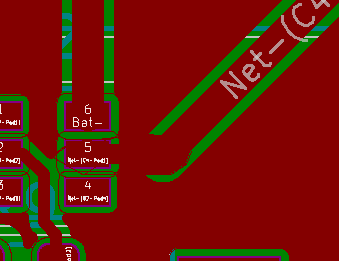
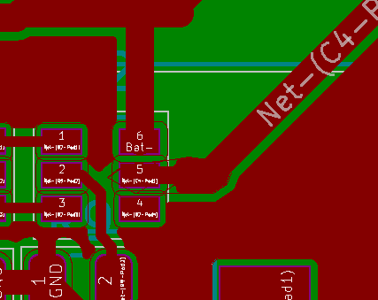

Troubleshooting
================

Problem 1 (Fixed)
-----------------
Initially I found out that the biggest problem I faced was because I had missed one zone priority allocation. This caused the ground plane to bleed into the zones that I had used for large tracks that connected to the IC's.

        Ground plane fill bleeding into non-ground zone

This was remedied by using a razor blade in order to cut the traces to disconnect the ground plane where it shouldn't have been connected.

.. figure:: Trace_Cut.jpg
        :width: 500px
        :align: center
        :height: 250px
        :alt: Bad PCB
        :figclass: align-center

        Cut Traces to disconnect from ground plane

Then a simple change to the zone allocation in the PCB files design fixes the problem in all future revisions. 

        Ground plane fixed

Problem 2 (Fixed)
-----------------------
When taking the charger out into the sun and turning on the boost converter there seems to be a solid 5V on the USB output. However, if I add any load to the output the circuit is unable to charge anything. 
Also, putting an ammeter in series with the battery and the solar charging circuit shows that there is very little current that is flowing. These things lead me to believe that the battery is somehow not connected to the circuit where it is supposed to be. 
This could be caused by just a misconnection of the circuit or maybe the lipo overcharge and overdischarge circuit is working too well. 
I think a good first test is to completely bypass the protection circuitry for now by connecting the negative terminal of the batter directly to ground instead of running it through the protection circuitry. Completely cutting out the lipo protection circuitry solved the issue for now.

It turns out that this problem found a few errors in the schematic. First the USB output was actually flipped from what it was supposed to be. The pinout for the schematic symbol matches a male connector and not a female connector.
This was fixed by flipping the connections in the schematic so GND is connected to :math:`V_o` and 5v is connected to GND. Eventually this should have a better fix of finding the appropriate footprint as the one currently used is for a male connector pinout. 

Second, the connections to the MOSFETs were just plain in the wrong place. Everything about the footprint and schmatic symbol fit perfectly I just connected it wrong. This has been ratified as of Rev1.1.

All of tThe problems were eventually ratified in the schematic and PCB layout as of Rev1.1. The symbol for the MOSFETs was also modified to improve connection clarity to prevent future mishaps.

